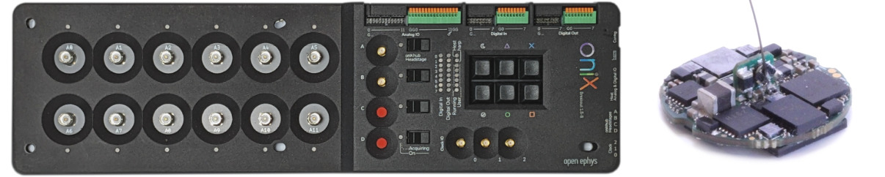

ONIX and Coaxial Headstage-64
****************************************************************

This section outlines how to use Bonsai software to automate commutation of the coaxial
tether between a headstage-64 mounted on a freely moving animal and ONIX.

#. Follow the :ref:`quick_start` to ensure you can control the commutator using Bonsai.

#. Install the **Bonsai.ONIX** Package from Bonsai's package manager.

   - Select Community Feed

     .. image:: ../../../_static/images/bonsai-community-feed.png
        :alt: Screenshot for selecting package source

   - Install **Bonsai.ONIX**

     .. image:: ../../../_static/images/install-bonsai-onix.png
        :alt: Screenshot for installing Bonsai.Onix

   .. Note:: You will not be able to open the workflow if ONIX is not already properly installed and connected

#. Download, configure, and run the following Bonsai workflow for automating commutation using orientation
   data from the headstage’s on-board IMU sensor:

   .. raw:: html

            
                
            

   -  Configure the **CommutatorSerialPort** property of the **BNO055 9-Axis IMU & Commutator** node to reflect the port
      to which the commutator is connected.

   -  Configure the **EnableStream** property of the **BNO055 9-Axis IMU & Commutator** node as *True*.

   -  Configure the **DeviceAddress** property of the **BNO055 9-Axis IMU & Commutator** node to reflect the address in
      which corresponds to the BNO055 for this particular headstage device. The correct address can be found by
      referencing the ONIContext table.

      .. image:: ../../../_static/images/bno-address.png

#. Run the workflow in Bonsai. If all above steps are correctly performed, the commutator will follow headstage rotations
