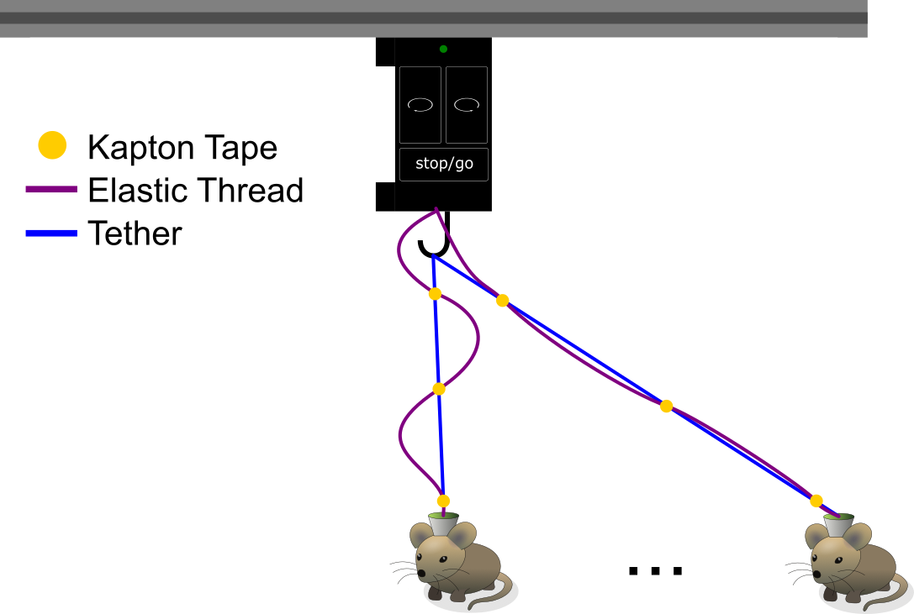
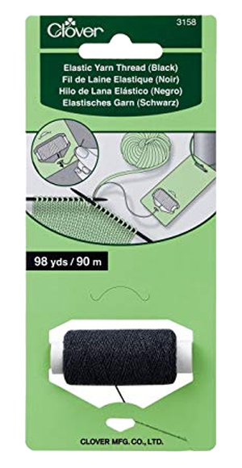

.. _mounting:

Mounting and Connecting
**************************************************************

Mounting
^^^^^^^^^^^^^^^^^^^^^^^^^^^^^^^^^^^^^^^^^^^^^^^^^
The commutator should be mounted such that it is roughly centered over the
behavioral arena. There are several holes in various positions around the
commutator's body that are compatible standard `80/20 aluminum extrusion
<https://8020.net/framing-options/t-slotted-profiles/fractional/10series100basedprofiles.html>`_
using `t-nuts <https://youtu.be/nK-DsJxAdwM>`_ or a standard mechanical
breadboard. Not all the holes need to be used. Select the mounting holes that
are convenient for your behavioral setup. For custom mounting solutions, the
dimensions for the mounting holes (1/4"-20 or M6) are indicated in the below
schematic:

.. image:: ../../_static/images/commutator-mounting-holes.png
    :alt: schematic image
    :align: center

.. note:: For clarity and planning, a 3D model of the commutator body is
   available on the `git repository <https://github.com/open-ephys/onix-commutator/tree/master/mechanical/single_channel>`_

If the commutator is used for an animal behavior experiment, mount it such that the animal can
traverse the behavioral arena. Elastic thread can be utilized to prevent the tether from entering
the animal's field while the it moves around. This is achieved by catching the thread onto
the gear hook and attaching it to the tether at various points using Kapton tape. 

    The Kapton tape dots (yellow) and elastic thread (blue) prevent the tether (purple) from draping into the mouse's
    field when the mouse is under the commutator as demonstrated in the top drawing while allowing the mouse to traverse
    the full space of the behavior arena as demonstrated in the bottom drawing.

`Clover 3158 <https://theknittersattic.co.uk/product/elastic-yarn-thread-black/>`__ is the
recommended elastic thread for this.

Connecting
^^^^^^^^^^^^^^^^^^^^^^^^^^^^^^^^^^^^^^^^^^^^^^^^^

Compatible Cables
#################################################

A variety of tethers are compatible with the commutator as long as they are terminated with a SMA connector (such as
the `Miniscope V4 tether <https://open-ephys.org/miniscope-v4/miniscope-v4-coax-cable-kit>`_) or something that can be
adapted to a SMA connector (such as the `headstage link <https://open-ephys.org/miniscope-v4/miniscope-v4-coax-cable-kit>`_)
on the commutator end. A standard, high quality SMA-SMA cable (such as
`these from Open Ephys <https://open-ephys.org/minicam/sma-to-sma-cable>`_)
can be used between the commutator and the data acquisition device.

Commutator Connectors
##################################################

.. raw:: html

    

        

            

                There are three electrical interconnects on the commutator:
            

        

        

            
        

        

                

                    

                        <ol class="simple">
                            <li>
<b>Micro-USB Connector:</b>
</li>
                            
 The commutator receives power and communicates to another device (probably a computer) with serial communication (USB/UART) through this interconnect 
 </ol>
                        </ol>
                    

                

                

                    

                        <ol class="simple" start="2">
                            <li>
<b>Top SMA Connector:</b>
</li>
                            
 The stationary cable connects to the stationary data acquisition device (DAQ) through this interconnect 

                        </ol>
                    

                

                

                    

                        <ol class="simple" start="3">
                            <li>
<b>Bottom SMA Connector:</b>
</li>
                            
 The rotary tether connects to the freely moving animal headstage through this interconnect 

                        </ol>
                    

                

        

    

.. Attention::
    * Some cheap Micro-USB cables only supply power. Ensure the cable used transfers both
      power and digital signals.
    * Source your coaxial cables from a reputable vendor such as `Digikey <https://www.digikey.com/>`_,
      `Mouser <https://www.digikey.com/>`_.
    * Source your coaxial tether from the `Open Ephys <https://open-ephys.org/store>`_ or make your own using
      `this guide <https://open-ephys.github.io/onix-docs/Hardware%20Guide/Headstages/tethers.html>`_.
    * For animal behavior experiments, manage the USB cable and the coaxial cable (between the commutator and DAQ)
      such that they are not within range to interfere with the tether when the animal moves. For example:

    .. image:: ../../_static/images/commutator-cable-management.png
        :alt: image suggesting cable management
        :align: center
