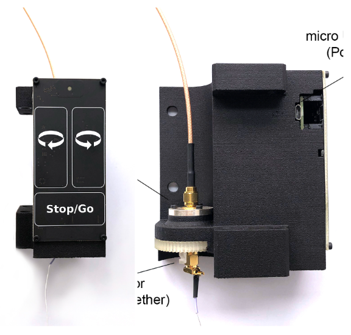

*************************************************
Open Ephys Commutators
*************************************************

TODO: Different photo? The GIF?

Overview
*************************************************

Open Ephys Commutators (OECs) are open-source, motorized commutators for reducing torsion of the tether that connects a
stationary data acquisition device to the headstage of a freely-moving animal undergoing electrophysiological or optical
measurement. OECs confer the following benefits to your ephys or miniscope experiments:

#. Promote exploratory behavior by reducing strain on the animal's head exerted by a heavy, twisted tether
#. Improve signal reliability by preserving the integrity of the tether and reducing the possibility of electrical disconnection

To learn more, please refer to the following guides:

Guides
*************************************************

.. raw:: html

    

      

        

          

            <a href = quick-start-guide/index.html>
                
                

                  
Quick Start Guide

                

            </a>
          

        

        

          

            <a href =  user-guide/index.html>
                
                

                  
User Guide

                

            </a>
          

        

        

          

            <a href = designer-guide/index.html>
                
                

                  
Developer Guide

                

            </a>
          

        

      

    

License
*************************************************

This work is licensed under CC BY-SA 4.0.

To view a copy of this license, visit https://creativecommons.org/licenses/by-sa/4.0/

.. toctree::
   :maxdepth: 2
   :titlesonly:

   quick-start-guide/index
   user-guide/index
   developer-guide/index
