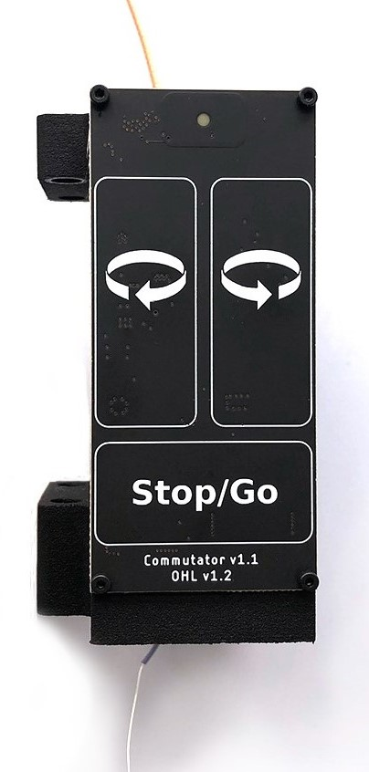

.. _oec:

.. title:: Home

|

**Open Ephys Commutators** provide nearly torque-free tether management for freely moving recordings. Inertial-measurement units (IMUs) or video-based pose-estimation methods (e.g. `DeepLabCut <https://github.com/DeepLabCut/DeepLabCut>`_ or `SLEAP <https://github.com/talmolab/sleap>`_) provide real-time measurements of animal orientation. Therefore, these technologies can be used to drive active commutation instead of relying on tether torque measurement, which is used in conventional active commutators. This permits the use of exceptionally thin tethers that promote natural animal behavior but are too flexible to be used with conventional commutators.

The **Coax Commutator** is compatible with `UCLA Miniscopes <https://open-ephys.org/miniscope-v4/miniscope-v4">`__ and `ONIX Headstages <https://open-ephys.github.io/onix-docs/Hardware%20Guide/Headstages/headstage-64/index.html">`__.

A commutator compatible with SPI cables is under active development.

.. toctree::
    :hidden:
    :maxdepth: 2
    :titlesonly:

    coax-commutator/index