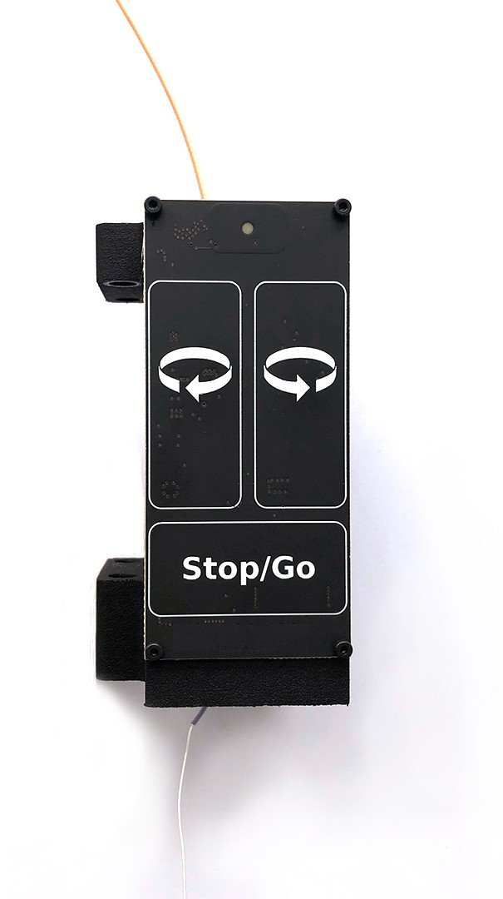

*************************************************
SMA Commutator
*************************************************

Welcome to the SMA Commutator documentation.

* To start operating the commutator as quickly as possible (using key presses), refer to the :doc:`quick-start guide<quick-start-guide/index>`.

* To learn other ways to control commutation, including interfacing the commutator with orientation data from specific hardware (such as miniscope v4, Onix, and custom hardware), refer to the more in-depth :doc:`user guide<user-guide/index>`.

* To learn how to design or build your own commutator, refer to the :doc:`developer guide<developer-guide/index>`.

.. toctree::
   :hidden:
   :maxdepth: 1

   Introduction <self>
   quick-start-guide/index
   user-guide/index
   developer-guide/index

.. TODO::
    * reformat picture next to words like overview page
