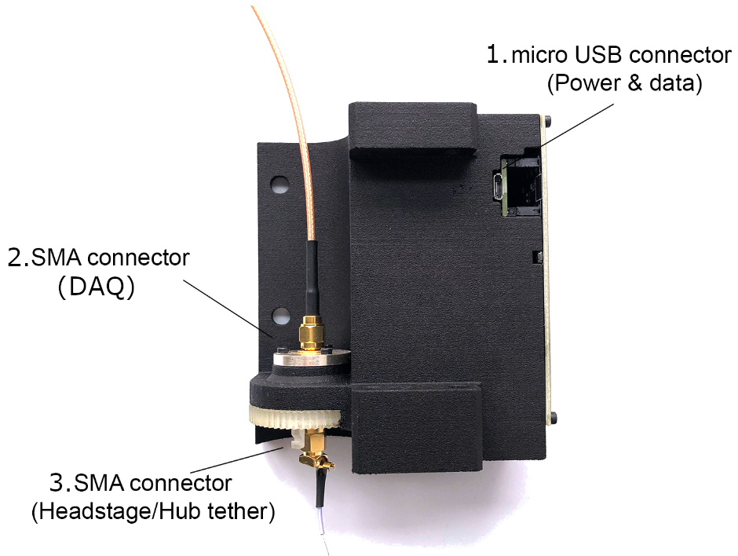

**************************************************************
Mounting and Connecting the Commutator
**************************************************************

Mounting
^^^^^^^^^^^^^^^^^^^^^^^^^^^^^^^^^^^^^^^^^^^^^^^^^

The commutator can be mounted to a standard `1" 80/20 aluminum extrusion <https://8020.net/framing-options/t-slotted-profiles/fractional/10series100basedprofiles.html>`_ using `t-nuts <https://youtu.be/nK-DsJxAdwM>`_ or a standard mechanical breadboard.
For custom mounting solutions, the dimensions for the mounting holes (1/4"-20 or M6) are indicated in the below schematic:

.. image:: ../../_static/images/commutator-mounting-holes.png
    :alt: schematic image
    :align: center

For more clarity, access the 3D model which can be downloaded `here <https://github.com/open-ephys/onix-commutator>`_ or
in the :doc:`Mechanical<../developer-guide/mechanical>` section of our :doc:`Developer Guide<../developer-guide/index>`
which contains more information about the enclosure and how to view such a file.

If the commutator is used for an animal behavior experiment, mount the commutator such that the animal can traverse the
behavior setup's full area given the length of your tether.

Connecting
^^^^^^^^^^^^^^^^^^^^^^^^^^^^^^^^^^^^^^^^^^^^^^^^^

There are three electrical interconnects on the commutator:

#. Micro-USB Connector

    The commutator receives power and communicates to another device (probably a computer) with serial communication (USB/UART) through this interconnect.

#. Top SMA Connector

    The commutator's stator connects to the stationary data acquisition device (DAQ) through this interconnect.

#. Bottom SMA Connector

    The commutator's rotor connects to the freely moving animal headstage through this interconnect.

.. Attention::
    * All cables must be appropriate length and within-spec

        .. TODO:: What are the appropriate lengths and specs? The SMA connector specs depends on the experiment/headstage, but I can at least specify the micro-USB specs

    * While establishing electrical connections, manage cables such that they are not within range to interfere with the tether when the animal moves. For example:

        .. TODO:: Another photo?

        .. image:: ../../_static/images/cable-management.png
            :alt: image indicating location of connections
            :align: center
